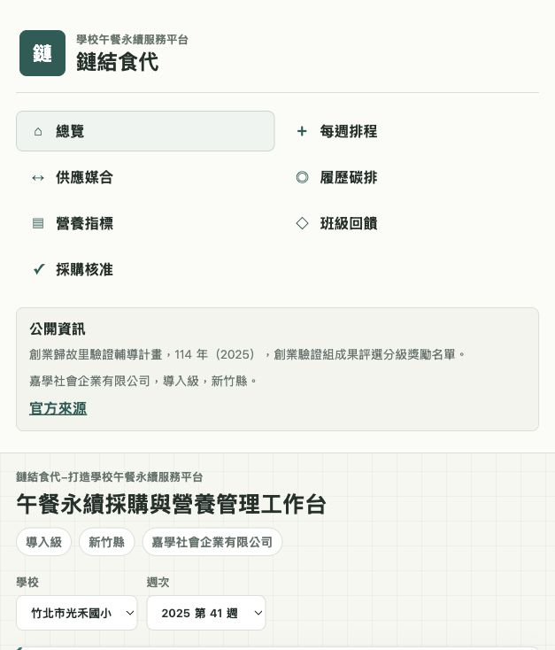
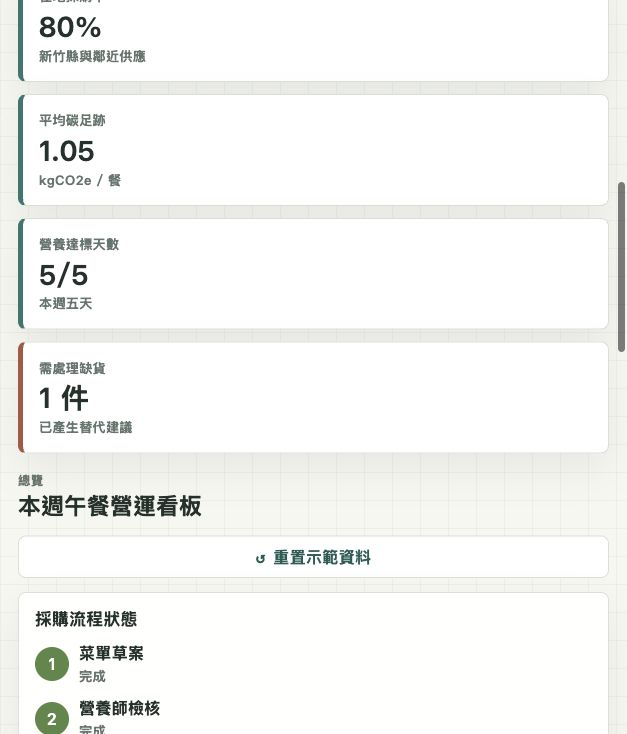

# 鏈結食代-打造學校午餐永續服務平台

## 快速看懂

- 線上 Demo：https://atlasforcn.github.io/startup-school-lunch-sustainability/
- 這個原型在做什麼：把鏈結食代做成學校午餐永續採購與營養管理平台。
- 特色定位：特色是把菜單、營養、在地供應商、碳足跡與採購核准串在同一個校務流程。
- 操作流程：安排每週菜單與營養目標 → 媒合在地供應商並看食材履歷 → 處理缺貨替代、班級回饋與採購核准

展開完整功能流程截圖

這是一個可直接用瀏覽器開啟的靜態 demo repo，將「鏈結食代-打造學校午餐永續服務平台」概念做成學校午餐永續採購與營養管理平台原型。頁面採用純 HTML/CSS/JavaScript，沒有外部依賴，適合放在 GitHub Pages。

## 比賽與公開資訊

- 比賽來源：創業歸故里驗證輔導計畫
- 年度：114 年（2025）
- 屆次/階段：創業驗證組成果評選分級獎勵名單
- 團隊/公司：嘉學社會企業有限公司
- 得獎/分類：導入級，新竹縣
- 作品名稱：鏈結食代-打造學校午餐永續服務平台
- 官方來源：https://sccontest.tca.org.tw/content/display#sectionA

## 原型功能

- 每週菜單排程：可切換日期、套用菜單範本，並更新營養與碳排摘要。
- 在地供應商媒合：依食材類別與縣市篩選供應商，查看履約、距離、驗證與缺貨狀態。
- 食材碳足跡/履歷：呈現產地、收成、檢驗、冷鏈與入校節點，以及食材碳排比較。
- 營養指標：以學校午餐管理視角追蹤熱量、蛋白質、蔬菜量、鈉含量與水果份量。
- 班級回饋：可新增班級滿意度與剩食回報，更新回饋列表與摘要。
- 缺貨替代建議：依缺貨項目提出替代食材與供應商，能一鍵排入當週菜單。
- 採購核准流程：呈現草案、營養師檢核、總務核准、校長核定與下單的流程狀態。

## 使用方式

直接用瀏覽器開啟 `index.html` 即可使用。不需要建置、不需要伺服器，也不會呼叫外部 API。

## 檔案

- `index.html`：平台介面與資料區塊
- `styles.css`：響應式儀表板樣式
- `app.js`：互動邏輯與內建示範資料
- `SOURCE.md`：資料來源、轉譯方式與免責聲明
- `README.md`：專案說明

## 免責聲明

這是依公開得獎資訊與概念自行製作的興趣原型，不是原團隊官方 demo 或產品。
